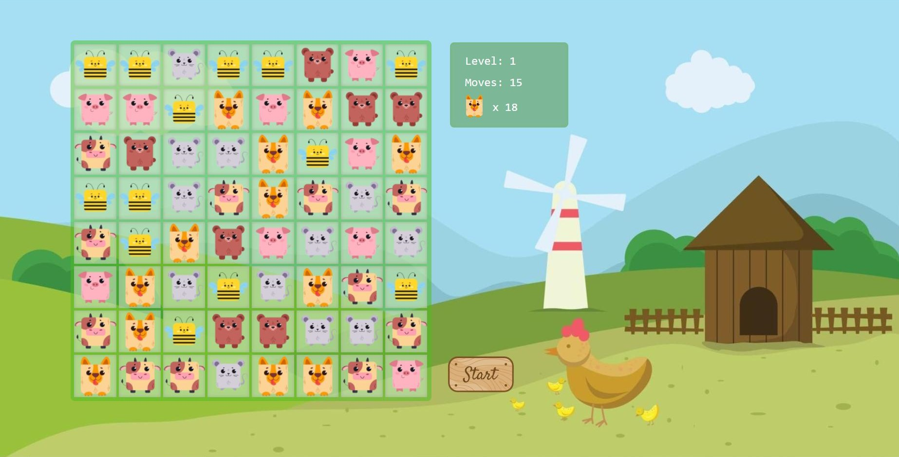

# candy-crush
A simple game inspired by Candy Crush made using JavaScript, CSS and HTML.

# Gameplay screenshot

# Setup
Download the project and open index.html

# How to play
Drag and drop the elements to switch their positions in order to match 3 or 4 in a row or column. You can only switch elements that are next to each other. 

Matching 4 elements in a row or column creates a bomb. Clicking the bomb pops all the elements from the board. 

Matching a square of 4 elements creates dynamite. Clicking the dynamite pops all the elements surrounding it.

Once you complete the final level, the game will automatically reset itself. 

By clicking the Start button, you go back to Level 1

# Credits
The base for the game was created by coding along @kubowania's (https://www.github.com/kubowania) YouTube tutorial. You can find it here: https://youtu.be/XD5sZWxwJUk
